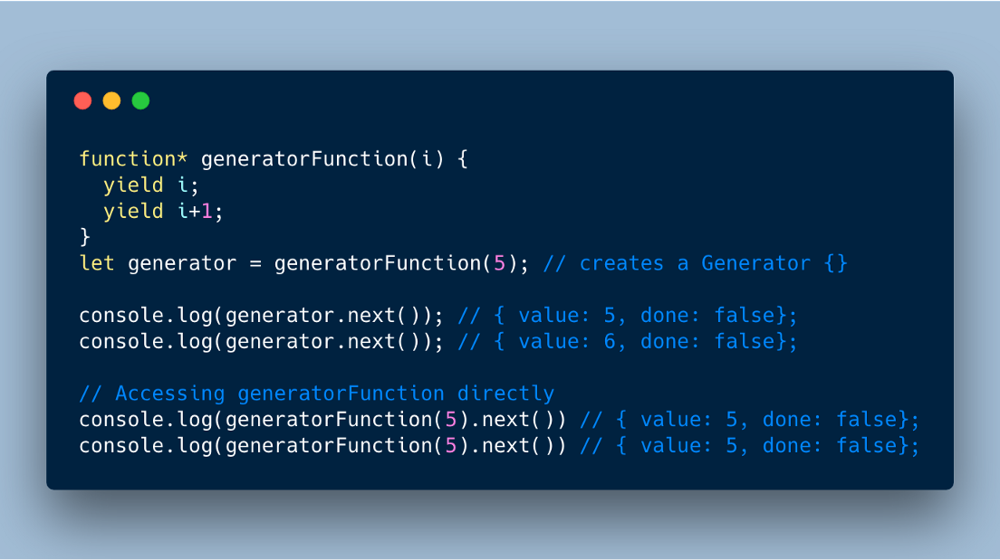

From [Mozilla](https://developer.mozilla.org/en-US/docs/Web/JavaScript/Reference/Statements/function*)

The function\* declaration (function keyword followed by an asterisk) defines a generator function, which returns a Generator object.

#### The key points of a Generator function

Functions in JavaScript, as we all know, “run until return/end”. Generator Functions on the other hand, “run until yield/return/end”. Unlike the normal functions Generator Functions once called, returns the Generator Object, which holds the entire Generator Iterable that can be iterated using next() method or for…of loop.

Every next() call on the generator executes every line of code until the next yield it encounters and suspends its execution temporarily.
Syntactically they are identified with a _, either function_ X or function \*X, — both mean the same thing.

Once created, calling the generator function returns the Generator Object. This generator object needs to be assigned to a variable to keep track of the subsequent next() methods called on itself. If the generator is not assigned to a variable then it will always yield only till first yield expression on every next().

The generator functions are normally built using yield expressions. Each yield inside the generator function is a stopping point before the next execution cycle starts. Each execution cycle is triggered by means of next() method on the generator.

On each next() call, the yield expression returns its value in the form of an object containing the following parameters.

```
{ value: 10, done: false } // assuming that 10 is the value of yield

```

**Value** — is everything that is written on the right side of the yield keyword, it can be a function call, object or practically anything. For empty yields this value is undefined.

**Done** — indicates the status of the generator, whether it can be executed further or not. When done returns true, it means that the function has finished its run.



Note: In the above example the generator function accessed directly without a wrapper always executes only until the first yield. Hence, by definition you need to assign the Generator to a variable to properly iterate over it.

#### Further Reading

[A Great Intro - a-simple-guide-to-understanding-javascript-es6-generators-d1c350551950](https://medium.com/dailyjs/a-simple-guide-to-understanding-javascript-es6-generators-d1c350551950)
