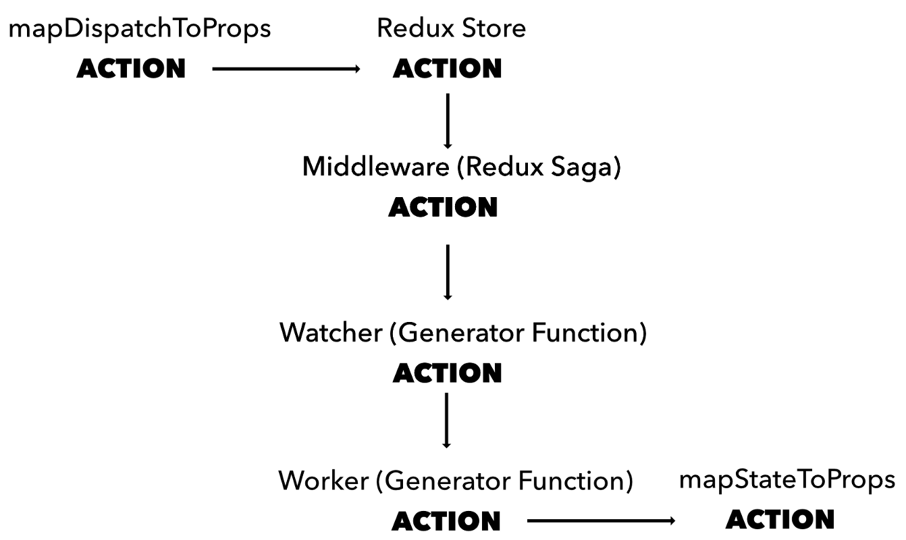

#### What Is Redux Saga?

Redux Saga is a library that’s used as a middleware for Redux. A Redux middleware is code that intercepts actions coming into the store via the dispatch() method and can take perform tasks based on the action received. Sagas watch all actions (observer/watcher) that are dispatched from the store. Before the action is passed on to the props, the other function (worker) will process what to do with the action in asynchronous flow.

Redux Saga uses an ES6 feature called Generators, which allows you to write asynchronous code. It’s important to know how the flow of Redux Saga works, specifically what happens with the Sagas (Generator Functions). Generator Functions allow queueing operations using yield, making it asynchronous.

